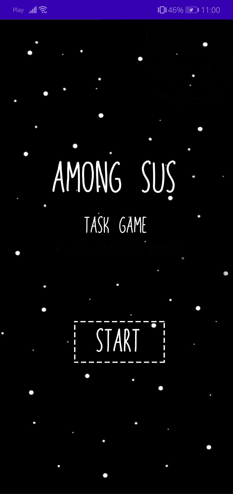
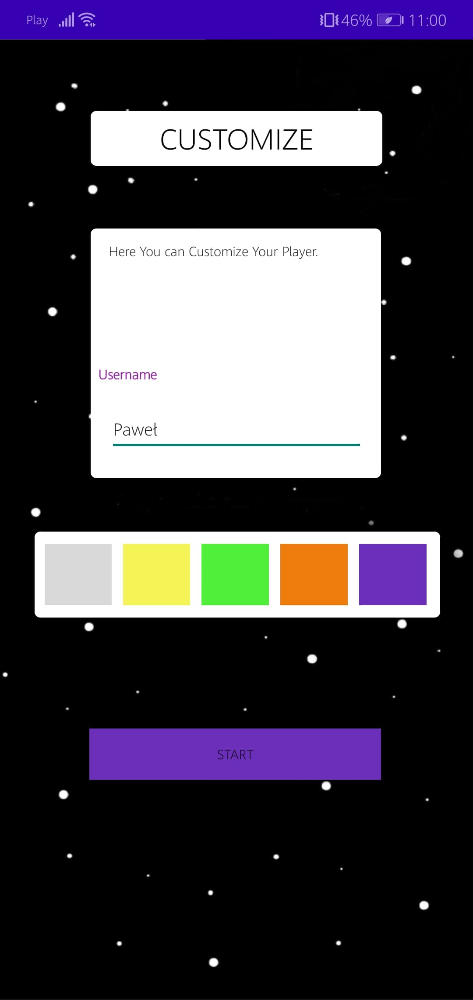
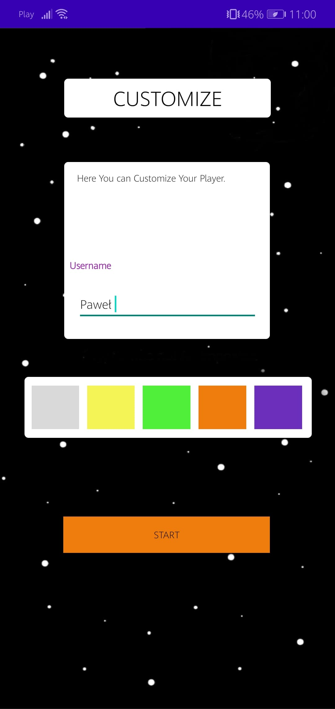
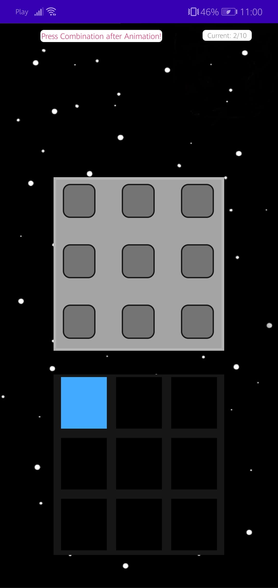
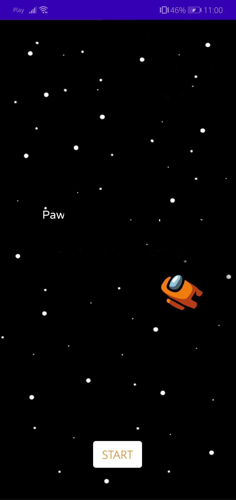
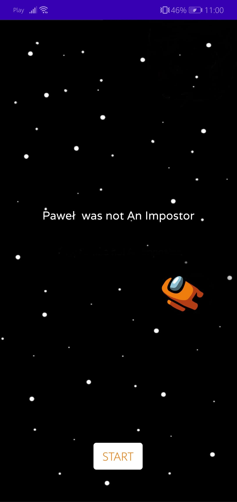

# 👨‍🚀 Among Sus
A simple Task from Game "Among Us"

This project have animations and music 

  
## 🕹️ Instalation
This files is a contaiment of main folder. I cannot upload full project becouse default libs weight too much.

To install it make a project with same name (and no activity) and copy those files
  

## 💻 Progress

██████████ 100%
 

 

## 📷 Screenshots

   
    
   
      

   
        
   

